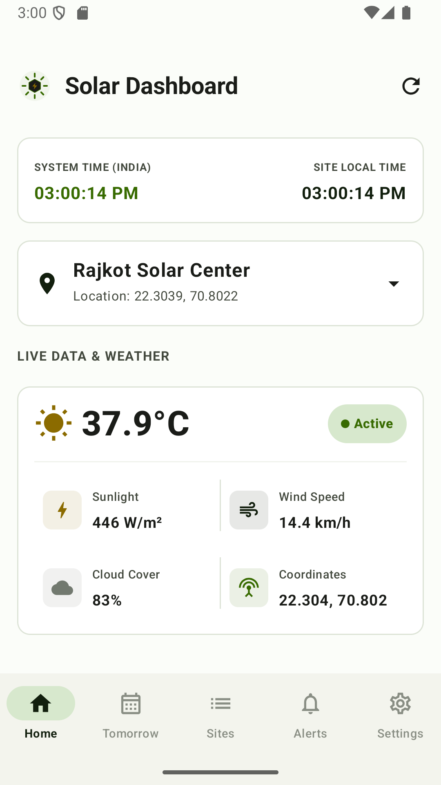
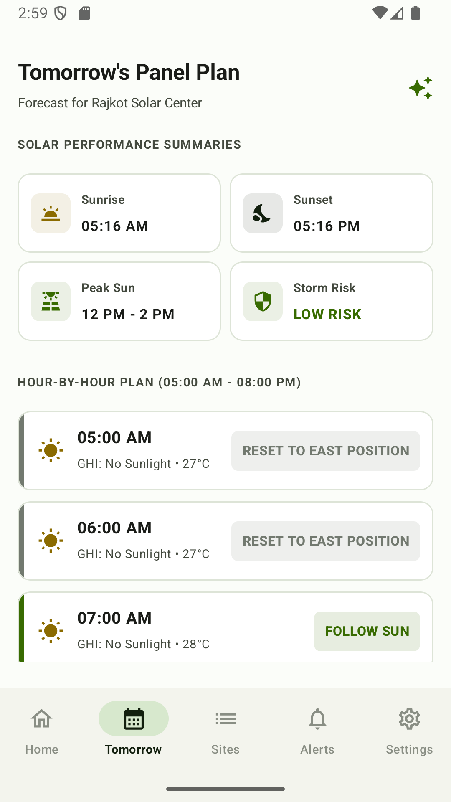
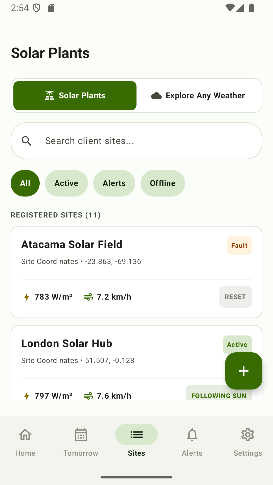
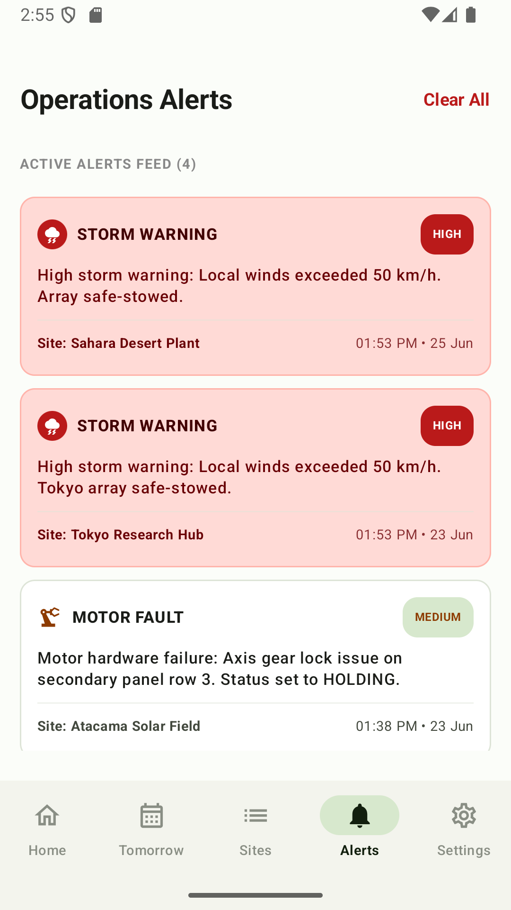
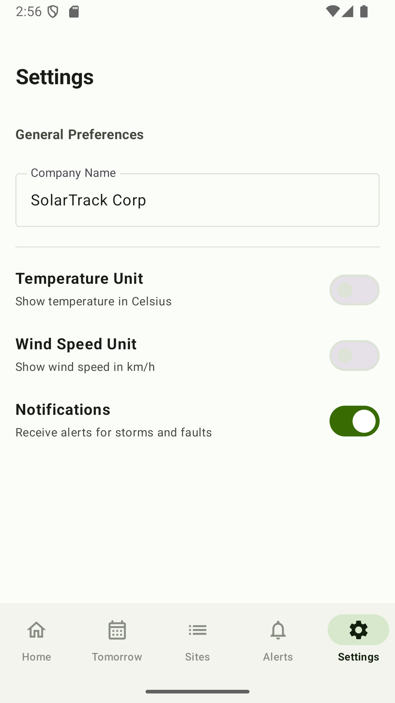
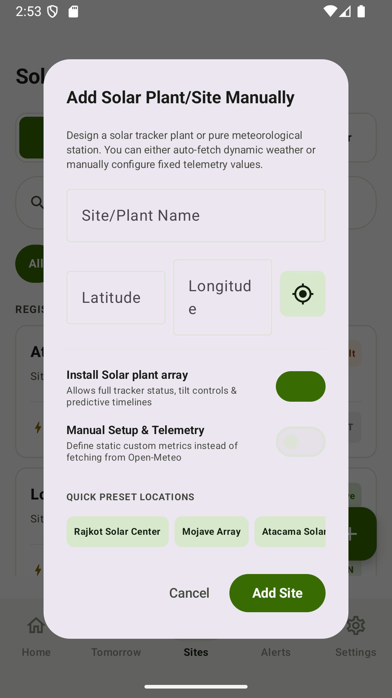

# SolarTrack


SolarTrack is a specialized Android application for managing solar panel arrays across multiple geographic sites. It connects to the Tomorrow.io and Open-Meteo APIs to pull real-time weather data, using that telemetry to calculate optimal panel tilt angles and trigger safety protocols. The app handles everything from storm stowing and rain protection to AI-driven production forecasting using the Gemini API, ensuring every site operates at peak efficiency while staying protected from the elements.

---

## Screenshots

Show all screens in a 2 column grid layout using HTML table:

<table>
  <tr>
    <td></td>
    <td></td>
  </tr>
  <tr>
    <td align="center">Home</td>
    <td align="center">Tomorrow</td>
  </tr>
  <tr>
    <td></td>
    <td></td>
  </tr>
  <tr>
    <td align="center">Sites</td>
    <td align="center">Alerts</td>
  </tr>
  <tr>
    <td></td>
    <td></td>
  </tr>
  <tr>
    <td align="center">Settings</td>
    <td align="center">Add Site</td>
  </tr>
</table>

---

## Why I Built This

I built this to automate the tedious manual monitoring required for remote solar installations. Managing panel tilt and safety stowing during unpredictable weather shouldn't require constant human attention. I wanted a system that could react instantly to wind speeds and precipitation to maximize yield during clear skies and lock down the hardware when storms hit.

---

## How It Works

The core flow starts when a user adds a site via GPS or manual coordinates. The app hits the Tomorrow.io API (falling back to Open-Meteo) to fetch a detailed weather telemetry package. This data flows through the local repository where it is processed against defined safety and tracking thresholds. Based on the wind speed, cloud cover, and time of day, the system determines a specific "Panel Action"—like "Follow Sun" or "Auto Stow"—which is then logged, cached in Room, and visualized on the dashboard.

---

## Screens

- **Home Screen**: Live dashboard showing real-time weather metrics and current panel tilt visualizer.
- **Tomorrow Screen**: Hourly prediction plan for the next daylight cycle including GHI and panel actions.
- **Sites Screen**: Overview of all registered solar plants with status badges and quick telemetry summaries.
- **Alerts Screen**: Chronological feed of operations events, including storm warnings and hardware faults.
- **Settings Screen**: Configuration for system units, company branding, and notification preferences.
- **Add Site Screen**: Interface for registering new plants with live GPS detection or manual telemetry setup.

---

## Panel Logic

The following logic is executed in `SolarRepository.kt` to determine the state of the solar array:

```kotlin
windSpeed > 50.0               → Auto stow (Storm)        → RED
precipitationProbability > 80.0 → Auto stow (Rain)         → RED
isNight                        → Reset to east position   → GRAY
windSpeed >= 30.0              → Safe mode                → ORANGE
cloudCover < 30.0               → Follow sun               → GREEN
else                           → Hold angle               → BLUE
```

---

## Tech Stack

- Jetpack Compose — UI toolkit used for the entire native interface.
- Room — Local SQLite database for site persistence, weather caching, and alert logging.
- Retrofit & Moshi — Networking stack for consuming Tomorrow.io and Open-Meteo APIs.
- Gemini API — Used to generate technical production insights and outlooks for the next day.
- Play Services Location — Integrated for detecting device coordinates when adding new sites.
- Coroutines & Flow — Manages asynchronous data streams across the repository and UI.

---

## Getting Started

### Prerequisites
- Android Studio Ladybug or higher
- minSdk 24
- targetSdk 37

### Setup
```bash
git clone https://github.com/Yanshu04/solar-tracker.git
cd solar-tracker
```
1. Open the project in Android Studio.
2. Create a `.env` file in the root directory.
3. Add your key: `TOMORROW_API_KEY=YOUR_KEY_HERE`.
4. Add your Gemini key: `GEMINI_API_KEY=YOUR_KEY_HERE`.
5. Sync Gradle and run the `app` module on a device or emulator.

---

## API

The app primarily uses the Tomorrow.io V4 API for weather data:

```
GET https://api.tomorrow.io/v4/weather/forecast
?location={latitude},{longitude}
&fields=temperature,windSpeed,cloudCover,precipitationProbability,solarGHI
&timesteps=1h
&apikey=YOUR_API_KEY
```

**Field Mapping:**
- `temperature`: Shown as the primary temperature metric on the Home dashboard.
- `windSpeed`: Monitored to trigger "Storm Mode" (> 50 km/h) or "Safe Mode" (>= 30 km/h).
- `cloudCover`: Determines if the system enters "Follow sun" (< 30%) or "Hold angle" mode.
- `precipitationProbability`: Used in the Tomorrow forecast to trigger "Auto stow (Rain)" warnings.
- `solarGHI`: Displayed as "Sunlight" in W/m² to estimate energy production.

---

## Project Structure

```
app/src/main/java/com/example/
├── data/
│   ├── api/          # Retrofit interfaces for Tomorrow.io and Open-Meteo
│   ├── db/           # Room Database, DAOs, and Entities
│   ├── model/        # Shared data classes (Site, Alert, Forecast)
│   └── repository/   # Core logic and data orchestration
└── ui/
    ├── screens/      # Compose-based UI for all 6 screens
    ├── theme/        # Custom design system and color palettes
    └── SolarViewModel.kt # Central state management
```

---

## Known Issues

- **Hardware Simulation Only**: The "Panel Angle" is a calculated UI value; it does not interface with actual motor controllers yet.
- **Static Timezones**: Default timezone handling relies on `Asia/Kolkata` if not provided by the API.
- **Mock Fallback**: If no API key is provided, the app falls back to a randomized weather simulation.
- **No Auth**: User authentication was removed; the app launches directly to the dashboard.

---

## License

No license specified.
